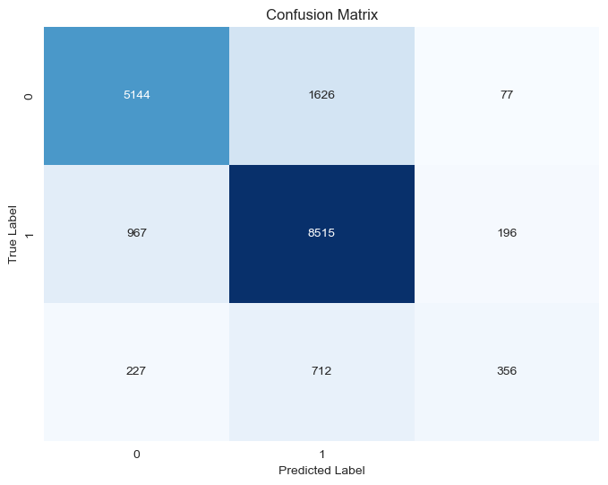

## Overview

This project uses classification as a predictor to determine one of three possible outcomes. Several models were used along with techniques like parameter tuning and perormance measuring. The result dshows that we were able to make a correct prediction about 79% of the time.

## Business and Data Understanding

The Tanzanian Ministry of Water has engaged us to predict which water pumps are functional,
which need repairs and which don't work at all. They need to know which waterpoints will fail as that can improve maintenance operations and ensure that clean, potable water is available to communities across Tanzania.

They have supplied us with data from the Taarifa waterpoints dashboard, which aggregates data from the Tanzania Ministry of Water. There are almost 15000 rows in the database. The data is supplied as a csv file and is mostly categorical data with a few numerical columns. There are very few missing values, not enough for concern with processing.

## Modeling

We attempted servral modles in this anaysis including Logistc Regression, Decision Tree, and Random Forrest Classifier.

A simple Logistic Regression model, without any tuning, had an accuracy score of .76 on the test dataset. Using a tuned Random Forrest Classifier had an accuracy score of .79. Other models included Logistc Regression using a binary target, and a parameter tuned Decision Tree Classifier. All produced similar results th the other models.

## Evaluation

Our goal was to predict the operational stat of the water pumps, which can be one of three, working, not working, working but needs repair. With our best model we were able to do this 79% of the time with the Random Forest Calssifier model.

The matrix shows that we were able to correctly predict a working pump 8515 times out of 9678. That is a 88% success rate. For non working pumps we correctly predicted 5144 out of 6847 non working pumps, a 75% average.
Pumps that were working and need repair were the most dificult to predict. We were 356 correct predictions out of 1295. That is 27%

## Conclusion

Here we achived limited success with an overall 79% prediction rate. Too many pumps that were funtional but need repair was classified as working. This area needs improvement in the next iteration. Possibly additional data may be required as we've reach the limitations of what was provided.

## Repository Structure

* ReadMe.md --------->            This file
* notebook.ipynb ------>       Project Jupyter notebook
* presentation.pdf ----->      Project presentation
* images --------------> Images used in the notebook and presentation
* zippedData ----------> Data files used for the project

